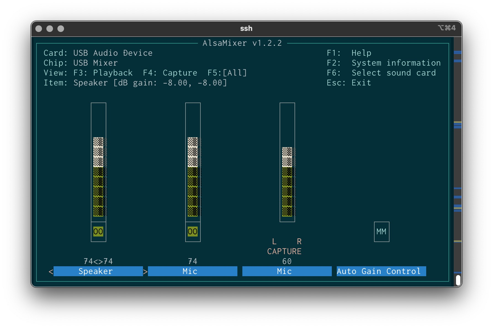

# HamSCI Grape 1 testing log

by Kenji Rikitake, JJ1BDX

## Testing condition

Setup on 18-NOV-2021

### Antenna

* 10MHz WWV/WWVH/BPM
* Antenna: Comet Antenna HFB-30 1m-length loaded horizontal whip
* With 5m x5 counterpoise wire on the balcony
* Connected to Grape 1 with 15m-length 5D-FB coax w/PL-239 connector
* PL-239-to-SMA cable: 50cm-length 1.5D-2V

### Grape 1 configuration

* Grape 1 driven voltage: ~~6.8V (with 7.5V AC adapter dropped by a silicon diode 1N4007)~~ pre-regulated by an [Akizuki Denshi TPS7A4700 low-noise DC regulator board](https://akizukidenshi.com/catalog/g/gK-06194/) of 7.5V input to 6.0V DC output
* Grape 1 filter position: 1-2 (10MHz)
* GPSDO: Leo Bodnar GPSDO Mini, 8mA, 9999kHz, driven with Apple iPad USB AC adapter
  - Low-noise power supply is strongly required for lesser noise
* Sabrent Adapter input level by alsamixer: ~~50/100~~ 60/100 (see below)

### Sabrent adapter settings

Alsamixer values:

* Playback Speaker: 74, monitor enabled
* Playback Mic: 74, monitor enabled
* Capture Mic: 60
* Auto Gain Control: OFF

Amixer log:

```
kenji@gravitas[1050]% amixer -c 4
Simple mixer control 'Speaker',0
  Capabilities: pvolume pswitch pswitch-joined
  Playback channels: Front Left - Front Right
  Limits: Playback 0 - 37
  Mono:
  Front Left: Playback 29 [78%] [-8.00dB] [on]
  Front Right: Playback 29 [78%] [-8.00dB] [on]
Simple mixer control 'Mic',0
  Capabilities: pvolume pvolume-joined cvolume cvolume-joined pswitch pswitch-joined cswitch cswitch-joined
  Playback channels: Mono
  Capture channels: Mono
  Limits: Playback 0 - 31 Capture 0 - 35
  Mono: Playback 23 [74%] [0.00dB] [on] Capture 26 [74%] [14.00dB] [on]
Simple mixer control 'Auto Gain Control',0
  Capabilities: pswitch pswitch-joined
  Playback channels: Mono
  Mono: Playback [off]
```

Alsamixer setting screen:



### fldigi settings

* Rig frequency: 9999kHz
* ANALYSIS mode
* Analyzing frequency: 1000Hz
* Audio input sample rate: 48000Hz
* Audio input RX ppm: -10ppm

[To be added and continued]

